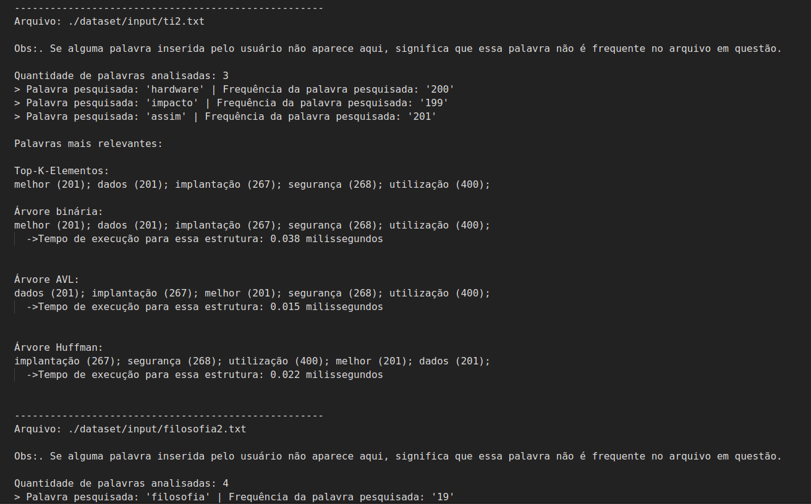

# Sistema de Autocompletar e Sugestões de Palavras

  
  
  
  
  
  

<!--=====================================================================================================================
## Questionário: ✅?
1. O código pode ser baixado do git? ✅
4. O código está bem estruturado e organizado? ✅
5. O código bem como a entrada seguem os padrões de pasta e nomes definidos? ✅
............................................................................
6. A documentação apresenta uma discussão sobre o problema?
7. A documentação apresenta como foi pensado a resolução do problema?
8. A documentação apresenta pequenos exemplos para explicar o funcionamento? ✅
9. A documentação apresenta conclusões sobre o trabalho?
10. A documentação detalha a forma como o código deve ser compilado? ✅

## Documentação ✅?
A documentação a ser produzida deve conter, pelo menos, as seguintes partes:
• Um detalhamento mínimo que explique as fases de especificação, projeto e implemen-
tação. Nessa etapa, deve-se incluir uma ampla discussão sobre as estruturas utilizadas
e o motivo de sua escolha para manter o desempenho da solução.

• Para os arquivos utilizados para teste, uma descrição da saída esperada.

• Uma parte do README.md contendo todas as instruções necessárias para a execução
de seu trabalho para arquivos de entrada diferentes dos adotados durante os testes.

• Um git contendo todo o projeto, bem como, toda descrição pertinente sobre sua execução,
projeto e implementação.

•  Neste documento (README.mb), espera-se observar uma discussão sobre as estruturas adotadas e o motivo de tal utilização.
Nesse último ponto, tente realizar um paralelo com outras estruturas para demonstrar de fato que as estruturas
adotadas são as melhores possíveis para o problema em questão.

1. Apresentando o problema ✅
2. Regras ✅
3. Implementação do problema
4. Resolução do problema ✅
5. Experimentação ✅
6. Análise de Complexidade
7. Conclusão
8. Compilação e Execução ✅

==============================================================================================================================-->

<!-- ## Wiki do Projeto 📚

Para obter informações mais detalhadas sobre o projeto, acesse a [**Wiki**](https://github.com/phpdias/autocompletar-e-sugestao-de-palavras/wiki).

Na Wiki, você terá acesso à documentação completa, instruções de execução e análise detalhada sobre as estruturas de dados, algoritmos utilizados e outros aspectos relevantes do projeto.

 -->

## Apresentando o problema 📝

Neste trabalho, o objetivo é criar um sistema que possibilite a funcionalidade de autocompletar e oferecer sugestões de palavras aos usuários. Para atingir essa finalidade, adotaremos a estrutura da árvore binária como base. Além disso, exploraremos outras estruturas, incluindo as árvores AVL e Huffman.

## Regras 📜

No arquivo disponibilizado pelo professor da disciplina, houveram algumas regras explícitas para serem seguidas. Disponível a seguir:

**1º Passo: Coleta de Dados**

[✔️] Iniciamos solicitando ao usuário um arquivo denominado [`input.data`](https://github.com/phpdias/autocompletar-e-sugestao-de-palavras/blob/main/dataset/wordToSearch/input.data), contendo uma lista de palavras. Cada palavra nesse arquivo será considerada como termo de pesquisa para o sistema.

**2º Passo: Modelo de Dados - Árvores Binárias**

[✔️] Utilizaremos um conjunto de árvores binárias para construir nosso sistema. Essas árvores serão criadas a partir de [`textos previamente fornecidos`](https://github.com/phpdias/autocompletar-e-sugestao-de-palavras/tree/main/dataset/input). O objetivo é estabelecer uma relação entre as palavras dos textos e as palavras de pesquisa.

**3º Passo: Sugestões de Palavras Relevantes**

[✔️] Para cada palavra no arquivo input.data, percorreremos as árvores binárias para identificar as palavras mais relevantes e próximas à palavra de pesquisa. Priorizaremos palavras frequentes e associadas ao termo de pesquisa.

**4º Passo: Resultados e Análises**

[✔️] Os resultados da análise serão apresentados em um arquivo chamado [`output.data`](https://github.com/phpdias/autocompletar-e-sugestao-de-palavras/blob/main/dataset/outputs/output.data). Esse arquivo conterá as relações entre as palavras pesquisadas e cada arquivo de texto. Além disso, a relevância de cada palavra será calculada com base em sua frequência nos textos. Para tal, foi utilizado o trabalho recentemente realizado, o [Top-K-Elementos](https://github.com/phpdias/top-k-elementos).

## Implementação do Problema 💡

A abordagem consistirá em três etapas diferentes:

- **Etapa 1: Árvore Binária Padrão**

Implementaremos uma [árvore binária tradicional](https://github.com/phpdias/autocompletar-e-sugestao-de-palavras/blob/main/src/binarytree.cpp), selecionando as palavras mais relevantes e relacionadas à pesquisa em cada texto. A relevância de uma palavra será determinada por sua frequência e proximidade à palavra de pesquisa.

- **Etapa 2: Codificação de Huffman**

Exploraremos o uso do [código de Huffman](https://github.com/phpdias/autocompletar-e-sugestao-de-palavras/blob/main/src/huffmantree.cpp) para otimizar a árvore binária padrão. Calcularemos códigos para cada palavra e reorganizaremos a estrutura da árvore com base nesses códigos. Avaliaremos se essa abordagem oferece vantagens em relação à anterior.

- **Etapa 3: Árvore AVL**

Implementaremos uma [árvore AVL](https://github.com/phpdias/autocompletar-e-sugestao-de-palavras/blob/main/src/avltree.cpp) e repetiremos o processo de análise. Compararemos o tempo médio de processamento entre a construção da estrutura e a geração de saída em comparação com as abordagens anteriores.

## Resolução do problema ✅

Após a conclusão do projeto, temos aqui um algoritmo capaz de:

- [✔️] Ler uma quantidade não determinada de textos onde serão pesquisadas as palavras do usuário;
- [✔️] Ler palavras de escolha do usuário para serem pesquisadas;
- [✔️] Processar esses textos tratando letras maiúsculas, minúsculas, espaços e pontuações;
- [✔️] Remoção de StopWords;
- [✔️] Utilização da estrutura de dados Hash;
- [✔️] Utilização da estrutura de dados MinHeap;
- [✔️] Utilização da estrutura de dados Árvore Binária;
- [✔️] Utilização da estrutura de dados Árvore AVL;
- [✔️] Utilização da estrutura de dados Árvore Huffman;
- [✔️] Demonstrar as **palavras mais relevantes** de um conjunto de dados utilizando cada uma das estruturas acima, identificando a palavra e a frequência da palavra para cada arquivo de texto, se assim disponível.

## Experimentação 🔬

  

### Entradas de dados necessárias 🗂️

Dentro do programa, encontra-se uma pasta denominada [dataset](https://github.com/phpdias/autocompletar-e-sugestao-de-palavras/tree/main/dataset), a qual abriga, em seu interior, outros 4 diretórios, nomeados como:

- [input](https://github.com/phpdias/autocompletar-e-sugestao-de-palavras/tree/main/dataset/input) que contém os textos a serem analisados;
- [outputs](https://github.com/phpdias/autocompletar-e-sugestao-de-palavras/tree/main/dataset/outputs) que contém o arquivo com os resultados;

- [stopwords](https://github.com/phpdias/autocompletar-e-sugestao-de-palavras/tree/main/dataset/stopwords) que contém palavras a serem desconsideradas dos textos originais;

- [wordToSearch](https://github.com/phpdias/autocompletar-e-sugestao-de-palavras/tree/main/dataset/wordToSearch) que contém as palavras inseridas pelo usuário para serem analisadas.

#### Diretório ./dataset/input 📂

Neste diretório se encontram os arquivos em texto que serão lidos análise.

O usuário é livre para definir se todos os arquivos dentro desse diretório sejam ou não do tipo `.txt`. Da mesma forma podem ser nomeados sem qualquer restrição.

**Obs:. Afim de garantir o correto funcionamento do algoritmo, recomenda-se utilizar arquivos '.txt' como padrão. Arquivos de outra natureza ficam por conta e risco do usuário.**

#### Arquivo stopwords.txt 🛑

Este arquivo foi retirado desse repositório git utilizado como referência: [Top-K-Elementos](https://github.com/phpdias/top-k-elementos) [^1]

Analogamente, também pode ser digitado manualmente pelo usuário, mas não é o intuito inicial a utilização dessa forma.

### Saídas obtidas

Após garantir a correta configuração dos arquivos acima, ao executar o programa, a seguinte saída será gerada em [`output.data`](https://github.com/phpdias/autocompletar-e-sugestao-de-palavras/blob/main/dataset/outputs/output.data).

Observe que existe um padrão nas impressões:

> Primeiro é identificado o arquivo analisado.

> Em seguida é mostrado a quantidade de palavras inseridas pelo usuário que foram analisadas naquele texto e a frequência dessas palavras no arquivo de texto em questão. Observe que existe uma nota pontuando que, caso alguma palavra inserida pelo usuário não esteja presente na contagem, significa que essa palavra em questão não está presente no texto desse arquivo.

> É demonstrado as palavras mais relevantes, separadas por: Top-K-Elementos utilizando MinHeap; Árvores Binária, AVL e Huffman utilizando como base o Top-K.

> Por último, mostra o tempo de execução daquela estrutura para aquele conjunto de dados.

> Esse processo ocorre a quantidade de vezes correspondente a quantidade de textos para serem analisados.

O resultado obtido está na imagem abaixo.

## Análise de Complexidade 🔎

Ao concluir esta tarefa, teremos uma compreensão mais aprofundada das diferentes implementações das árvores binárias e sua influência no sistema de autocompletar e sugestões de palavras. A análise comparativa de complexidade nos permitirá avaliar a eficácia de cada abordagem em termos de desempenho e funcionalidade.

# Conclusão 🎯

# Compilação e Execução 🔄

Este algoritmo possui um arquivo Makefile e um arquivo CMakeLists que realiza todo o procedimento de compilação e execução. Para tanto, temos as seguintes diretrizes de execução:

## Comandos para Linux:

|  | Função                                                                                  |
| ------------------------------------------------------------------------------------------------------------------------------------------------------- | --------------------------------------------------------------------------------------- |
| `make clean`                                                                                                                                            | Apaga a última compilação realizada contida na pasta build                              |
| `make`                                                                                                                                                  | Executa a compilação do programa utilizando o gcc, e o resultado vai para a pasta build |
| `make run`                                                                                                                                              | Executa o programa da pasta build após a realização da compilação                       |
| `make r`                                                                                                                                                | Realiza o `make clean`, `make` e `make run` em sequência                                |

## Comandos para Windows:

|  | Função                                                                                        |
| ---------------------------------------------------------------------------------------------------------------------------------------------------- | --------------------------------------------------------------------------------------------- |
| `cmake -B ./build-debug`                                                                                                                             | Executa geração de arquivos e o resultado vai para a pasta build-debug                        |
| `cmake --build ./build-debug`                                                                                                                        | Executa a compilação do programa utilizando o gcc, e o resultado vai para a pasta build-debug |
| `./build-debug/app`                                                                                                                                  | Executa o programa da pasta build-debug após a realização da compilação                       |

# Contatos 📇

| Contato    | Telegram                                                                                                                                                                             | LinkedIn                                                                                                                                                                                           | Email                                                                                                                                                                                                                                                                                   |
| ---------- | ------------------------------------------------------------------------------------------------------------------------------------------------------------------------------------ | -------------------------------------------------------------------------------------------------------------------------------------------------------------------------------------------------- | --------------------------------------------------------------------------------------------------------------------------------------------------------------------------------------------------------------------------------------------------------------------------------------- |
| Pedro Dias | <a href="https://t.me/phpdias"> | <a href="https://linkedin.com/in/phpd">
 | <a href="mailto:phpdias@outlook.com?subject=[GitHub]%20Autocompletar%20E%20Sugestão%20De%20Palavras">
 |

## Referências

[^1]: [GitHub](https://github.com/phpdias/top-k-elementos)
[^2]: [CppReference](https://en.cppreference.com/)
[^3]: [CPlusPlus](https://cplusplus.com/)
